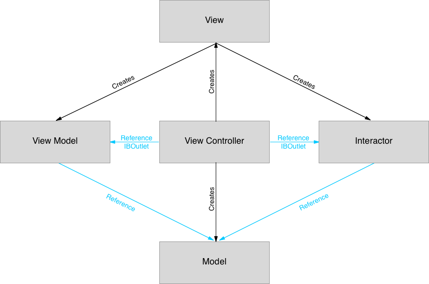

# Swift-IO

Swift-IO is an experiment on finding a better architecture for ios project.  
The purpose, like MVVM, VIPER, MVP, etc is to solve the MVC (Massive View Controller) problem.

# Creations & ownership
Here is the creations and ownership diagram :

The View Contoller creates the view (using storyboard), then the View creates the Interactor and the View Model.

# Interface Builder
The Interactor and the View Model are created using an IB Object :

# Flow
The flow contains 7 steps :

## 1
You add your IBActions directly in your Interactor, and link them in IB, without having to use the controller as a wrapper.  
You can also add IBOutlets in your Interactor, for example if you need to retrieve login passwords values before calling a web service

## 2
The Interactor calls Actions (I will explain this part later).  
Actions can be of any kind, calling a web service, sorting data, etc.

NB : The View Controller can also ask the Interactor to process an Action for initial loading for example.

## 3
When the action is complete the Interactor updates the Model

## 4
Then the Interactor notifies the View Controller (which registered as delegate of the Interactor in ViewDidLoad)

## 5
The View Controller triggers an update of the View by asking the ViewModel to refresh a part or whole of the View

## 6
The View Model retrieves data that needs to be updated from the Model and format them.

## 7
The View Model push the formatted data to the view using IBOutlets

# Actions

I previously told you about Actions called by the Interactor.  
These actions follows the command pattern, and can be of multiple kinds, you'll find some examples in the Action folder, they all implements the Action protocol which has two methods for running an action with a callback, and cancelling an action.

The interesting point with these actions is that in an agile context, it fits the user stories :
- As a user, I want to visualize the list of countries
- As a user, I want to sort the countries by alphabetic order
- ...

And these actions are very reusable.

# Feedback
Please let me know what you think about this, and suggest improvements.